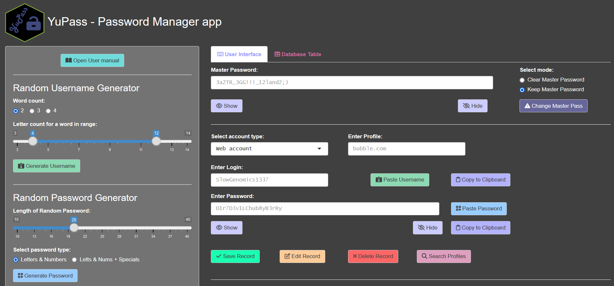
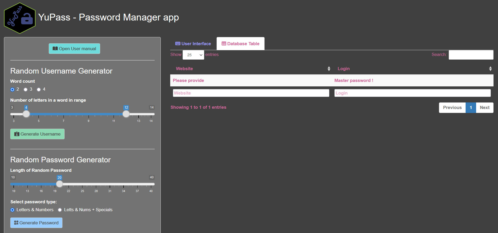

# YuPass - Password Manager app
This is a simple and lightweight Password manager built with R and Shiny.\
The main goal of this app is to enable seemless interaction with your encrypted password database.\
What I like about YuPass is that you always know where your encrypted databse is stored, compared to most password manager solutions, whily providing strong AES-256 encryption (32-byte key).\
I have worked on this project in my free time to help me out improve my R and Shiny skills and knowledge.\
I could not find a usable password manager written in R and Shiny, so I decided to try and build one :)

Current version v1.2
- Profiles and Logins can easily be browsed in the _*Database Table*_ tab (Master Password needed) 🔥**NEW**🔥
- You can now choose a Profile category from a list _and_ add your own categories 🔥**NEW**🔥

# Setup
Option 1: Hosted locally (Strongly Recommended !)
1. Download all provided files.
2. Encrypted Database will be creted in the the location\
**C:\\Users\\<<YOUR_USERNAME>>\\YuPass_Password_Manager\\**
3. Download and install the [shinyShortcut](https://cran.r-project.org/web/packages/shinyShortcut/README.html) package and follow the instructions. 
4. Run the _shinyShortcut_ command. You will get a standalone .VBS executable file which can be executed without R or RStudio being open.
5. You can create a shortcut of the resulting shinyShortcut.vbs executable. In order to change the shortcut icon you right-click on the shortcut => Properties => Shortcut => Change icon (there is a really nice golden/yellow lock icon).
6. Read the provided in-app user manual at least once :)

Option 2: Hosted online, e.g. shinyapps.io (NOT Recommended !)
1. Download all files and create an account in shinyapps.io and follow their instructions furter.
2. Here you will need a persistent data storage solution. One possibilty is to host your database in Dropbox with the help of the [rdrop2](https://cran.r-project.org/web/packages/rdrop2/) package. You can create access keys (tokens) which can allow your Shiny app to read and write files from and to your Dropbox folder.
3. You will need to modify the code a bit. You will need the special functions for reading the encrypted database from Dropbox _drop_read.aes_ by providing the database filename, encryption key and Dropbox access token. Once you have done changes to the database, you create file in the virtual environment with _write.aes_ function and you upload it to Dropbox with _drop_upload_ by providing name and Dropbox token.

# User manual (same as the in-app one)
1. Input Your Master Password to access the encrypted Database. Master Password is needed for every operation!
2. You can Keep the Master Passward continuously, or Clear it after every operation.
3. Encrypeted database will be created together with the first Record you provide.
4. You can Edit a Record by providing Website and Login. You select Record to be edited and press Edit. You can change Website, Login and Password and then you need to Confirm the Edit procedure.
5. You can Delete a Record by providing Website and Login. You need to confirm the Delete procedure.
6. You can Search for Website in the Database. You can Delete and Type inside the Search field.
7. You can Search for Logins of the chosen Website.
8. You can Load the Record to visualize the Password.
9. You can Close the Search section afterwards.
10. You can Download the Encrypted Database.
11. You can Remove the Duplicates from the Encrypted Database.
12. You can use the Random Username Generator and the Random Password Generator to help you out.
13. You can Generate many different Usernames and add Number at the end if you desire.
14. You can Generate Passwords only with Letters and Numbers, or it can also contain Special characters.
15. All Fields are displayed in a special font to improve readability between symbols such 0 (digit zero) and O (upper case o), and I (upper case i) and l (lower case L). 

# Acknowledgements and my thanks
1. To the creators of the [EncryptDF](https://git.doit.wisc.edu/lsaim/EncryptDF) package, which build borrows code from Stackoverflow comment from [jlhoward](https://stackoverflow.com/questions/25318800/how-do-i-read-an-encrypted-file-from-disk-with-r). I have modified their code a bit for our purposes. Thanks to them we have the backbone of the our app - the encrypted password database.
2. To the creators of the [rclipboard](https://github.com/sbihorel/rclipboard/) package. It was really useful for this project with the random username and passwords.
3. To the creator(s) of the [Words](mailto:condwanaland@gmail.com) package. It was especially useful for our random username generator. Nice resource to have.
4. To [Dean Attali](https://deanattali.com/) for the packages _**shinyjs**_ and _**shinyalert**_ which we have used here. But Mr. Attali is doing so much more and creating amazing tools for us to use in Shiny. Feel free to check him out.
